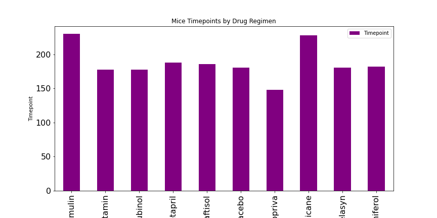

#   The Power of Plots
## Matplotlib
### Background
Good data tells story! Even better if you are able to visualize the data. Matplotlib applied to real-world situations help to showcase the importance of data analysis.

As a senior data analyst at a Pharmaceutical company, based in San Diego, you have been given access to the complete data from their more recent animal study. There are 248 mice identified with sqamous cell carcinoma (SCC) tumor growth. Mice were treated with 10 different drug regimens. Over 45 days, tumor developement was observed and measured to see the effectiveness of each drug or placebo regimen. The study aimed to compare the performance of Pymaceuticals' drug of interest, Capomulin, versus th other drug treatment regimens. Executives have tasked you to generate all of the tables and figures needed for the technical report of the study. They requested a top-level summary of the study results.

## Observable Trends

* Total number of mice is 248, after removing duplicates. The total count of mice by gender also showed that 124 female mice and 125 male mice.

* Correlation between mouse weight and average tumor volume is 0.84. There is a positive correlation, when the mouse weight increases the average tumor volume also increases.

* The regression analysis helped with understanding how much the average tumor volume (dependent variable) will change when weight of mice change(independent variables). The R-squared value is 0.70, which means 70% of the model fit the data, wich is fairely good to predict the data from the model. Higher R-squared values represent smaller differences between the observed data, and the fitted value. 70% the model explains all of the variation in the response variable around its mean.

* Capomulin and Ramicane reduces the size of tumors better that the other drug treatments.

## Bar and Pie Charts
> Bar charts were created using pandas and matplotlib that shows the number of mice for each drug regimen treatments by timepoint(days).

